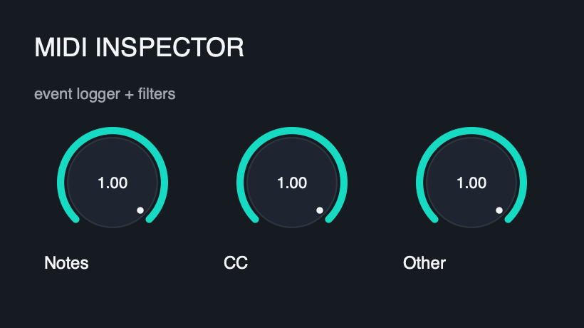
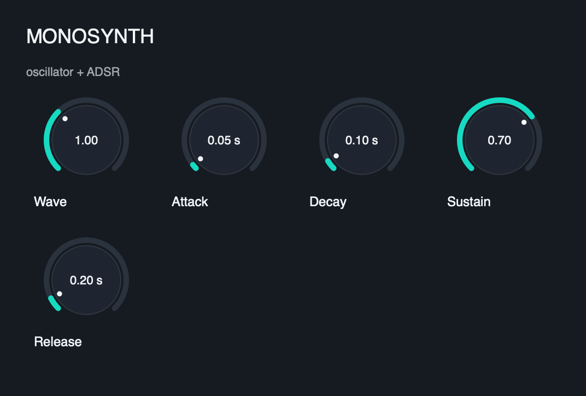
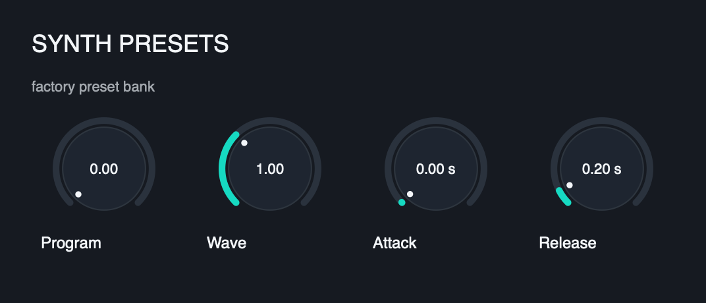

# Pulp Example Plugins

A small set of **companion example plugins** built as [Pulp](https://www.generouscorp.com/pulp/)
SDK examples — each a self-contained `Processor` that compiles to VST3 / CLAP /
standalone (and AU / AUv3 / AAX where the platform SDKs are available), with a
test that asserts real behavior.

Where [pulp-classic-effects](https://github.com/danielraffel/pulp-classic-effects)
showcases DSP effects, these round out the rest of the SDK contract surface — a
pure MIDI utility, a minimal instrument, and a UI fixture.

## Status

| Example | Editor | DSP | Test | Notes |
|---|---|---|---|---|
| MIDI Transpose |  | ✅ | ✅ | Pure MIDI effect — semitone note shifter, passes CC/bend/SysEx through |
| SysEx Echo |  | ✅ | ✅ | MIDI effect — round-trips System Exclusive payloads (echo on/off) |
| MIDI Inspector |  | ✅ | ✅ | MIDI pass-through that logs events (counts, ring, filters, dropped) via TripleBuffer |
| State Memo |  | ✅ | ✅ | Custom plugin state (a free-text memo) beyond automatable params; fail-safe (de)serialize |
| MPE Spreader |  | ✅ | ✅ | MIDI effect — gives every held note its own MPE member channel (note-off integrity, recycle) |
| MonoSynth |  | ✅ | ✅ | Minimal monophonic instrument (oscillator + ADSR), MIDI in → audio out |
| Synth With Presets |  | ✅ | ✅ | Instrument + factory preset bank, pitch bend & mod-wheel vibrato; clean recall semantics |
| gui-zoo |  | ✅ | ✅ | UI fixture — widgets/layout/Skia paint with a deterministic screenshot baseline |

## Credits

Inspired by truce-audio's [truce](https://github.com/truce-audio/truce) example
suite. Reimplemented from scratch on Pulp's own primitives.

## License

MIT — see [LICENSE](LICENSE). See also [Pulp licensing](https://www.generouscorp.com/pulp/licensing.html).

## Building

These examples consume the Pulp SDK. The simplest path is to scaffold against an
existing Pulp checkout/install with `pulp create`, which pins the SDK and wires
the build for you. To build this repo directly:

```bash
cmake -S . -B build -DCMAKE_BUILD_TYPE=Release \
      -DCMAKE_PREFIX_PATH=/path/to/pulp/install
cmake --build build -j
ctest --test-dir build --output-on-failure
```
