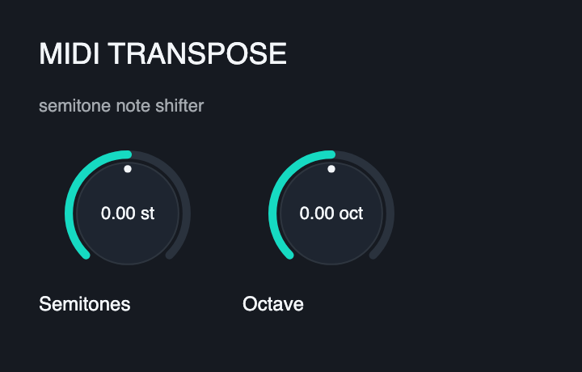
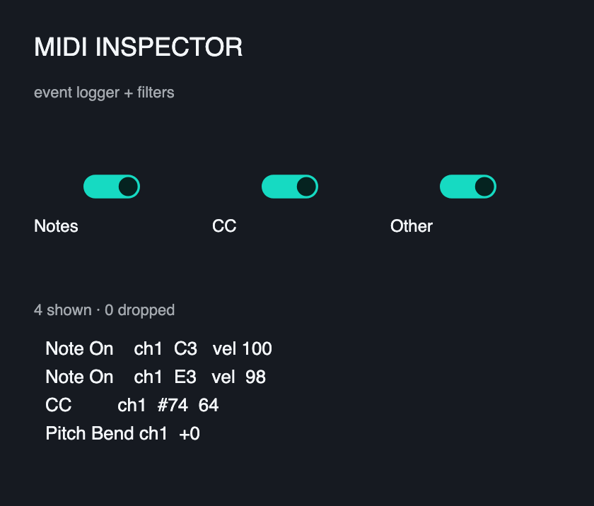
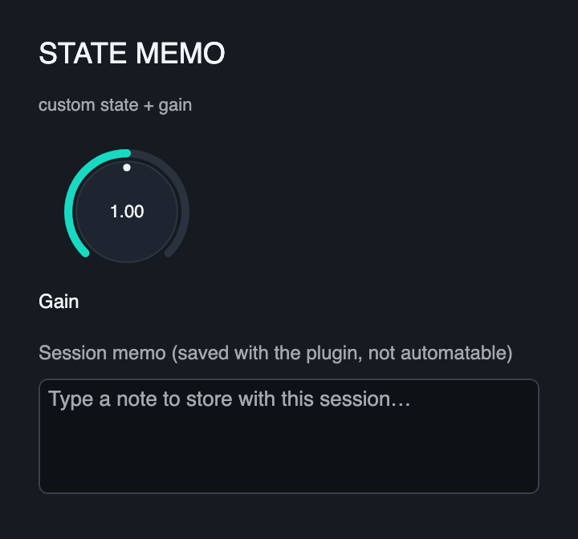
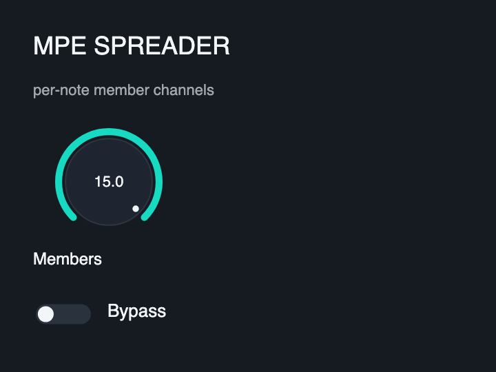
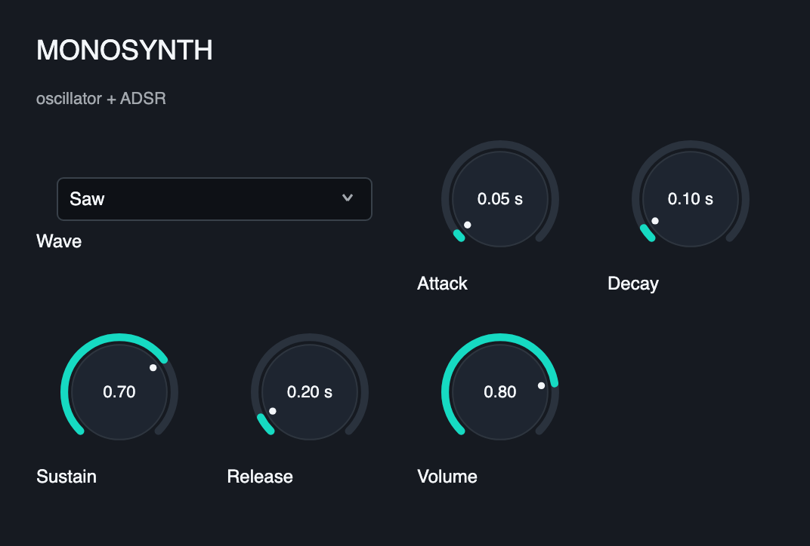
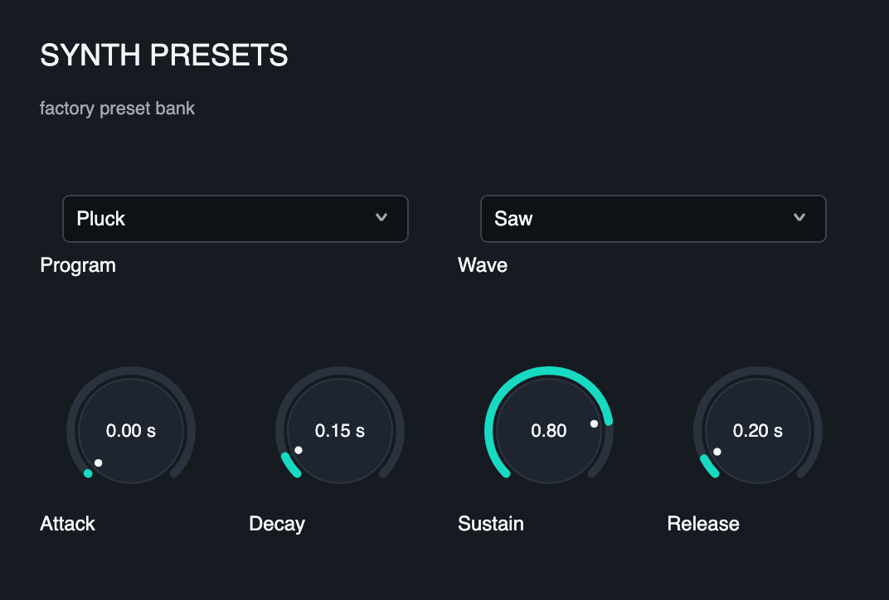
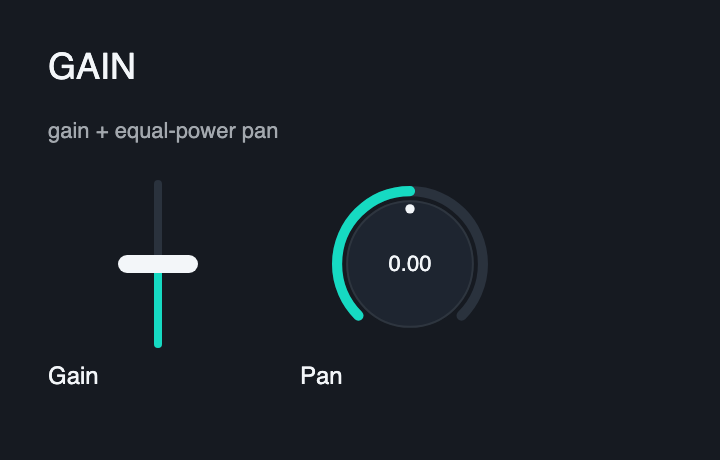
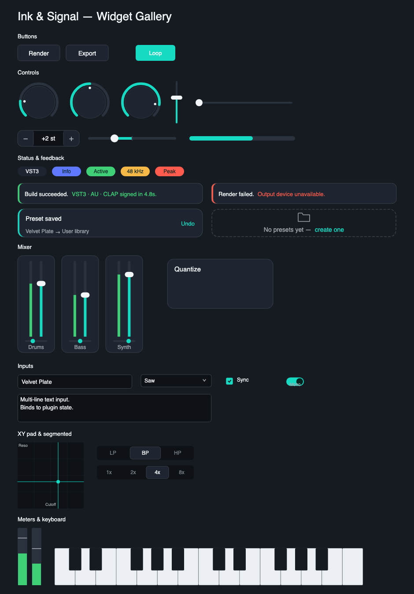

# Pulp Example Plugins

A small set of **companion example plugins** built as [Pulp](https://www.generouscorp.com/pulp/)
SDK examples — each a self-contained `Processor` that compiles to VST3 / CLAP /
standalone (and AU / AUv3 / AAX where the platform SDKs are available), with a
test that asserts real behavior.

Where [pulp-classic-effects](https://github.com/danielraffel/pulp-classic-effects)
showcases DSP effects, these round out the rest of the SDK contract surface — a
pure MIDI utility, a minimal instrument, and a UI fixture.

## Status

**Try the live web demos** — every plugin below runs in the browser on the **same
C++ `Processor`** as the native plugin, offered two ways:

- **[WAM gallery ▶](https://danielraffel.github.io/pulp-example-plugins/)** — the
  `Processor` compiled with Emscripten to a single-threaded WebAssembly module in an
  `AudioWorklet`, packaged as [WAM v2](https://www.webaudiomodules.com/). Runs on any
  static host (plain GitHub Pages); no special headers.
- **[WebCLAP gallery ▶](https://pulp-wclap-demos.pages.dev/example-plugins/)** — the
  same `Processor` compiled with wasi-sdk (`wasm32-wasi-threads`, shared memory)
  exposing the real **CLAP ABI** to a worklet-resident CLAP host. Requires
  cross-origin isolation, so it is served from Cloudflare Pages.

Both paths share the audio engine and differ only in a thin per-target adapter — see
**[WAM vs WebCLAP: how the web demos are built](web/WAM-vs-WEBCLAP.md)** for
the full, evenhanded comparison. In each row the editor screenshot and the **▶ WAM** /
**▶ WebCLAP** links open that plugin's "click to start" page.

> **What you're actually seeing.** The on-page editor is a *token-faithful
> HTML/canvas recreation* of each plugin's controls, **not** the native
> Skia-rendered editor: `create_view()` returns `nullptr` in wasm, so the real
> editor cannot run on this path. In **Safari there is no WebMIDI**, so the
> on-screen keyboard is the primary input; a hardware MIDI controller is
> progressive enhancement on Chrome/Edge. The links **404 until GitHub Pages is
> switched to "GitHub Actions"** as the publishing source (a one-time
> repo-settings toggle) — see [`web/README.md`](web/README.md). The start
> overlay's play glyph is from Lucide (ISC); its notice travels with the site at
> [`/CREDITS.txt`](https://danielraffel.github.io/pulp-example-plugins/CREDITS.txt).

| Example | Editor | Web demos | Notes |
|---|---|---|---|
| MIDI Transpose | <a href="https://danielraffel.github.io/pulp-example-plugins/midi-transpose/"></a> | [▶ WAM](https://danielraffel.github.io/pulp-example-plugins/midi-transpose/) · [▶ WebCLAP](https://pulp-wclap-demos.pages.dev/example-plugins/midi-transpose/) | Pure MIDI effect — semitone note shifter, passes CC/bend/SysEx through |
| SysEx Echo | <a href="https://danielraffel.github.io/pulp-example-plugins/sysex-echo/"></a> | [▶ WAM](https://danielraffel.github.io/pulp-example-plugins/sysex-echo/) · [▶ WebCLAP](https://pulp-wclap-demos.pages.dev/example-plugins/sysex-echo/) | MIDI effect — round-trips System Exclusive payloads (echo on/off) |
| MIDI Inspector | <a href="https://danielraffel.github.io/pulp-example-plugins/midi-inspector/"></a> | [▶ WAM](https://danielraffel.github.io/pulp-example-plugins/midi-inspector/) · [▶ WebCLAP](https://pulp-wclap-demos.pages.dev/example-plugins/midi-inspector/) | MIDI pass-through that logs events (counts, ring, filters, dropped) via TripleBuffer |
| State Memo | <a href="https://danielraffel.github.io/pulp-example-plugins/state-memo/"></a> | [▶ WAM](https://danielraffel.github.io/pulp-example-plugins/state-memo/) · [▶ WebCLAP](https://pulp-wclap-demos.pages.dev/example-plugins/state-memo/) | Custom plugin state (a free-text memo) beyond automatable params; fail-safe (de)serialize |
| MPE Spreader | <a href="https://danielraffel.github.io/pulp-example-plugins/mpe-spreader/"></a> | [▶ WAM](https://danielraffel.github.io/pulp-example-plugins/mpe-spreader/) · [▶ WebCLAP](https://pulp-wclap-demos.pages.dev/example-plugins/mpe-spreader/) | MIDI effect — gives every held note its own MPE member channel (note-off integrity, recycle) |
| MonoSynth | <a href="https://danielraffel.github.io/pulp-example-plugins/mono-synth/"></a> | [▶ WAM](https://danielraffel.github.io/pulp-example-plugins/mono-synth/) · [▶ WebCLAP](https://pulp-wclap-demos.pages.dev/example-plugins/mono-synth/) | Minimal monophonic instrument (oscillator + ADSR), MIDI in → audio out |
| Synth With Presets | <a href="https://danielraffel.github.io/pulp-example-plugins/synth-with-presets/"></a> | [▶ WAM](https://danielraffel.github.io/pulp-example-plugins/synth-with-presets/) · [▶ WebCLAP](https://pulp-wclap-demos.pages.dev/example-plugins/synth-with-presets/) | Instrument + factory preset bank, pitch bend & mod-wheel vibrato; clean recall semantics |
| Gain | <a href="https://danielraffel.github.io/pulp-example-plugins/gain/"></a> | [▶ WAM](https://danielraffel.github.io/pulp-example-plugins/gain/) · [▶ WebCLAP](https://pulp-wclap-demos.pages.dev/example-plugins/gain/) | Plain utility effect — linear gain (fader) + equal-power pan (knob); stereo in → out |
| gui-zoo |  | —[^gui-zoo] | Installable widget-gallery plugin — a zero-DSP pass-through effect whose editor scrolls the full Ink & Signal widget board; also a deterministic screenshot fixture |

[^gui-zoo]: gui-zoo has no web demo. It is a `Processor` whose only content is `create_view()`, and `create_view()` hard-returns `nullptr` in every WASM build (`core/format/src/wasm/headless_defaults.cpp`) — with no DSP and no reachable UI on this path there is nothing to run in the browser.

## Install the macOS package

Prebuilt macOS installers are published on the
[Releases](https://github.com/danielraffel/pulp-example-plugins/releases) page.
The package installs the AU, VST3, and CLAP builds of the examples and lets you
choose formats in the installer Customize pane.

Prefer to build everything yourself? See [Building](#building).

<details>
<summary><strong>Optional: verify before installation</strong> (click to expand)</summary>

For an additional check before installing, download the package and verify its
SHA-256 checksum against the release's `SHA256SUMS` file:

```bash
version=0.2.0
asset="PulpExamplePlugins-${version}.pkg"
base="https://github.com/danielraffel/pulp-example-plugins/releases/download/v${version}"

curl -fSLO "$base/$asset"
curl -fSLO "$base/SHA256SUMS"
awk -v file="$asset" '$2 == file { print }' SHA256SUMS | shasum -a 256 -c -
```

Update `version` if you are installing a newer release.

You can also inspect the macOS package signature:

```bash
pkgutil --check-signature "$asset"
```

The checksum confirms the downloaded file matches the release asset. GitHub
also exposes a SHA-256 digest for release assets in the Releases UI and API. The
current macOS package is built and notarized outside GitHub Actions, so this
release does not claim GitHub Actions build provenance.

</details>

## How the web demos work

Each demo runs the **same audio code as the native plugin** — not a
reimplementation. A Pulp plugin's engine is a C++ `Processor`; the exact same
source that compiles to the VST3 / CLAP / AU builds is also compiled, via
[Emscripten](https://emscripten.org/), to a **WebAssembly** module. In the
browser that module runs on the real-time audio thread inside a Web Audio
[`AudioWorklet`](https://developer.mozilla.org/en-US/docs/Web/API/AudioWorklet),
packaged as a [WAM (Web Audio Module) v2](https://www.webaudiomodules.com/)
plugin. The compile target is Emscripten's
[Wasm Audio Worklets](https://emscripten.org/docs/api_reference/wasm_audio_worklets.html).

**What's identical, and what differs:**

- **DSP (the sound) — identical.** Oscillators, envelopes, the MIDI logic — the
  same `.hpp` that ships in the native plugin, compiled to WebAssembly and driven
  block-by-block from the AudioWorklet. MIDI, SysEx, and saved state all cross the
  same ABI the native hosts use.
- **Editor (the UI) — a faithful recreation.** The native plugin renders its
  editor with Skia, which isn't available in the browser (`create_view()` returns
  `nullptr` in the WASM build). So each page rebuilds the controls as HTML/Canvas
  widgets that read the **same Ink & Signal design tokens** — it looks and behaves
  like the native editor without being the same renderer.

Audio never auto-plays: every demo waits behind a click-to-start overlay, and an
instrument demo gives you an on-screen keyboard (and your computer keyboard) to
play it.

The WAM gallery above is one of **two** web builds of the same `Processor`. The
second, **WebCLAP**, compiles that same C++ with wasi-sdk and runs it through the
real **CLAP ABI** in the browser (which needs a cross-origin-isolated host). For a
neutral, side-by-side account of how the two are built, what they share with the
native plugin, and the tradeoffs of each, see
[**WAM vs WebCLAP: how the web demos are built**](web/WAM-vs-WEBCLAP.md).

## Credits

Inspired by truce-audio's [truce](https://github.com/truce-audio/truce) example
suite. Reimplemented from scratch on Pulp's own primitives.

## License

MIT — see [LICENSE](LICENSE). See also [Pulp licensing](https://www.generouscorp.com/pulp/licensing.html).

## Building

These examples consume the Pulp SDK. The simplest path is to scaffold against an
existing Pulp checkout/install with `pulp create`, which pins the SDK and wires
the build for you. To build this repo directly:

```bash
cmake -S . -B build -DCMAKE_BUILD_TYPE=Release \
      -DCMAKE_PREFIX_PATH=/path/to/pulp/install
cmake --build build -j
ctest --test-dir build --output-on-failure
```

### Editor screenshots

Each plugin exposes its editor through `Processor::create_view()`, so the dark
Ink & Signal panel shown below is what loads in any VST3 / AU / CLAP host or the
standalone app — no extra wiring per format.

The `Editor` column above is rendered from the baselines in `screenshots/`.
`test_editors.cpp` builds each editor through `create_view()` (the real host
path), re-renders it with Skia, and compares it pixel-wise against its committed
baseline, so an unintended UI change fails CI. For plugins with parameters it
also pushes every param off its default and asserts the render visibly changes,
proving the editor is bound to live plugin state. After a deliberate editor
change, rebake the baselines:

```bash
PULP_BAKE_SCREENSHOTS=1 ctest --test-dir build -R editors --output-on-failure
git add screenshots && git commit -m "chore: rebake editor screenshots"
```

The test skips cleanly when the SDK build has no Skia raster backend.
(gui-zoo keeps its own fixture test + `gui-zoo/baseline.png`.)
