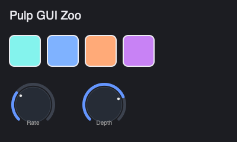

# gui-zoo

A small **UI fixture** that exercises Pulp's view / widget / layout / Skia paint
path and produces a **deterministic screenshot artifact**. It is not a plugin —
it builds a static `View` tree (a panel, a title label, four bordered color
swatches, two labeled knobs) using Yoga flex layout and renders it headlessly.

## What it validates (Pulp SDK contract)

- Yoga flex layout in C++ (`View::flex()` — sizing/position, **not** absolute
  `set_bounds`, which the layout pass overrides).
- Core widgets: `Label` (font size + color), bordered/rounded `View` panels,
  `Knob` (value + label).
- Headless rendering via `render_to_png(..., ScreenshotBackend::skia)` (CPU Skia
  raster — no GPU window needed).
- A **content-floor** check (`analyze_screenshot_content().passes_content_floor()`)
  so a blank/near-blank render fails, and a **baseline comparison**
  (`compare_screenshots`, similarity > 0.97) against the checked-in
  `baseline.png`.

The test SKIPs cleanly where the Skia raster backend isn't available, so a
Skia-less build stays green. Re-bake the baseline only intentionally (render
`build_gui_zoo()` to `baseline.png`) — per-OS baselines are fine if a platform's
font/AA differs.
